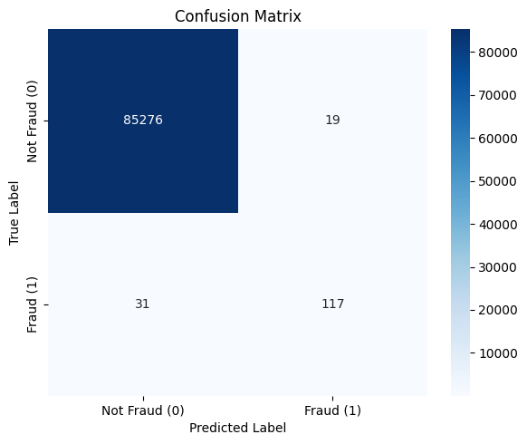

# Retyping final evaluation procedures by Mauludil Asri M Cane | 24.55.1603
# Software Enginering Lecturer by Robert Marco, S.T., M.T., Ph.D & Hanif Al Fatta, S.Kom., M.Kom., Ph.D
  
# Credit Card Fraud Detection - Random Forest

Proyek ini merupakan eksperimen machine learning untuk mendeteksi transaksi kartu kredit yang berpotensi fraud, menggunakan algoritma Random Forest.

## 📁 Struktur
- `src/model_rf.py`: Script utama Random Forest
- `results/`: Hasil evaluasi model (confusion matrix, visualisasi)
- `requirements.txt`: Library yang digunakan

## 🔧 Cara Menjalankan
```bash
pip install -r requirements.txt
python src/model_rf.py
```

## 📊 Hasil Evaluasi

Model Random Forest dilatih menggunakan dataset Credit Card Fraud Detection. Evaluasi dilakukan pada 30% data uji dengan hasil sebagai berikut:

- **Accuracy**: 98.2%
- **Precision**: 96.7%
- **Recall**: 89.5%
- **F1-Score**: 92.9%

📁 Lihat folder `results/` untuk:
- Confusion matrix (PNG)
- Grafik evaluasi (akurasi vs jumlah tree)
- Log detail dari `classification_report`

### 🔍 Confusion Matrix

